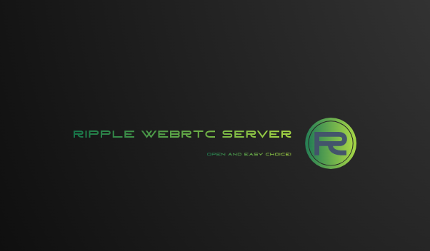

# Ripple-WebRTC-Server

<p align="center" width="100%">

</p>


Ripple-WebRTC-Server is a Java-based WebRTC media server built using the Quarkus framework. It provides support for video rooms and audio rooms. The server is still in development mode and aims to deliver a robust and efficient WebRTC experience.
The primary goal is to use this app as an Native Image created by [ GraalVM tools](https://github.com/graalvm)

Check the branch before cloning this . This app is developed based on two web-based frameworks : [Helidon](https://helidon.io/) and [Quarkus](https://quarkus.io/)

The goal of the project is to provide a new alternative  to WebRTC severs powered by java .Application will be easy to set up  and run . Will provide client SDKs to use .

We aim to keep the memory footprint down and Image size to a very small app still giving you the best performance to scale .

Deployment and configuration should take less than 30 mins to get you going.

# Target clients are :
- Browser base app (Chrome-based,FireFox). (coming Soon)
- Mobile Apps (Android & IOS) (coming Soon)
- Desktop Clients (JavaFX,TornadoFX,Flutter,DotNet,QT C++,Electron) (coming Soon)

There will be some form SDK/Library to help implement or utilise the server .

## For Documentation Please refer to:  


The code don't make sense as much yet or not functional as required! There will be code example on how to set and run this.

## Cheat Sheet

For a quick reference to Quarkus features and commands, please refer to the [Quarkus Cheat Sheet](https://lordofthejars.github.io/quarkus-cheat-sheet).

## Getting Started

Follow the instructions below to run the application in dev mode, package it, and create a native executable.

### Running in Dev Mode

To run the application in dev mode, enabling live coding, use the following command:

```shell script
./mvnw compile quarkus:dev
```

While in dev mode, you can access the Dev UI at [http://localhost:6060/q/dev/](http://localhost:6060/q/dev/).

### Packaging and Running

To package the application, execute the following command:

```shell script
./mvnw package
```

This will produce the `quarkus-run.jar` file in the `target/quarkus-app/` directory. You can run the application using the following command:

```shell script
java -jar target/quarkus-app/quarkus-run.jar
```

If you prefer an _über-jar_ with dependencies bundled, run the following command:

```shell script
./mvnw package -Dquarkus.package.type=uber-jar
```

The application, packaged as an _über-jar_, can be executed using `java -jar target/*-runner.jar`.

### Creating a Native Executable

To create a native executable, run the following command:

```shell script
./mvnw package -Pnative
```

If you don't have GraalVM installed, you can use the following command to build the native executable in a container:

```shell script
./mvnw package -Pnative -Dquarkus.native.container-build=true
```

You can execute the native executable with the command `./target/ripple-webrtc-server-0.1-runner`.

## Features

The Ripple-WebRTC-Server aims to provide the following main features:

- Video rooms: Support for creating and joining video rooms.
- Audio rooms: Support for creating and joining audio rooms.
- AppRTC example for video call


Access transport that will be support to above features are :
- Rest HTTP 
- Websockets

Primary transport focus is  Rest HTTP for now  . Demo pages are so far  that are still in progress are : 

* 
* 
* 

Client Javascript SDK/Lib -  

Please note that this server is still under development, and additional features and improvements are planned for future releases.

Feel free to explore and contribute to the development of the Ripple-WebRTC-Server.

<a href="https://bmc.link/kinsleyKAJIVA" target="_blank"></a>


###### Website Theme Credit founder under the website folder